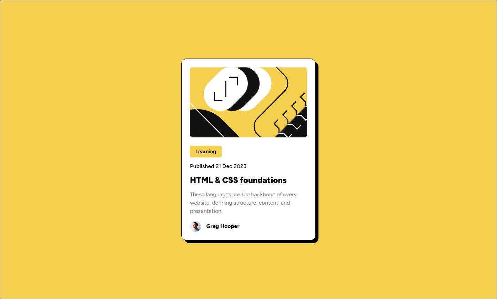

# Frontend Mentor - Blog preview card solution

This is a solution to the [Blog preview card challenge on Frontend Mentor](https://www.frontendmentor.io/challenges/blog-preview-card-ckPaj01IcS). Frontend Mentor challenges help you improve your coding skills by building realistic projects. 

## Table of contents

- [Overview](#overview)
  - [The challenge](#the-challenge)
  - [Screenshot](#screenshot)
  - [Links](#links)
- [My process](#my-process)
  - [Built with](#built-with)
  - [What I learned](#what-i-learned)
- [Author](#author)

## Overview

### The challenge

Users should be able to:

- See hover and focus states for all interactive elements on the page

### Screenshot

### Links

- Solution URL: [Solution URL here](https://github.com/andrew-j-brown/Blog-Preview-Card)
- Live Site URL: [Live site URL here](https://andrew-j-brown.github.io/Blog-Preview-Card/)

## My process

### Built with

- HTML5
- CSS custom properties
- Flexbox

### What I learned

~~This project gave me practice using fonts stored in an asset folder as opposed to linking to Google fonts. I also got to use some flexbox to arrange the card elements.

I really enjoyed setting up the card's box shadow to only update when the heading is hovered, rather than hovering anywhere on the card.~~

The two main things I learned about on this project, were pointer events (to prevent the drop shadow from updating unless the heading is hovered) and the clamp function (to dynamically resize the font without relying on media queries).

## Author

Will be updated upon completion.

- Frontend Mentor - [@andrew-j-brown](https://www.frontendmentor.io/profile/andrew-j-brown)
